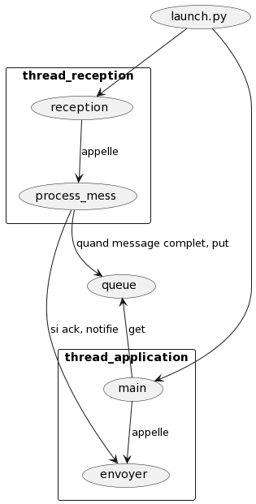

# Info

Code de haut niveau pour controler les actions et la stratégie du robot

## Lidar

### [lidar](./lidar) : analyse des données du lidar - code réalisé par Seb 

## QR codes

### [aruco-decoder](./aruco-decoder) : Décodage des qr-code sur les faces trésors

## Transport 

### [protocole_transport_raspi](./protocole_transport_raspi) : protocole de transport pour communiquer avec les STM - code réalisé par Aude 
- [launch.py](./protocole_transport_raspi/launch.py) : lance un thread réception et un thread application : exécuter **python3 launch.py** pour lancer le code 
- [api_envoi.py](./protocole_transport_raspi/api_envoi.py) : fonction **envoyer** 
- [api_reception.py](./protocole_transport_raspi/api_reception.py) : fonctions **reception** et **process_mess** 
- [application.py](./protocole_transport_raspi/application.py) : fonction **main** 
- [utiles.py](./protocole_transport_raspi/utiles.py) : classes **Trame** et **Message**, diverses variables, dictionnaires **buffer_reception** et **buffer_acks** 
- [format_du_bash.txt](./protocole_transport_raspi/doc/format_du_bash.txt) : format de la réception et de l'envoi de la librairie can-utils utilisée par ce code 

### note : 
le dossier code_coupe_de_france contient le code du transport et du lidar (jamais testé) 
